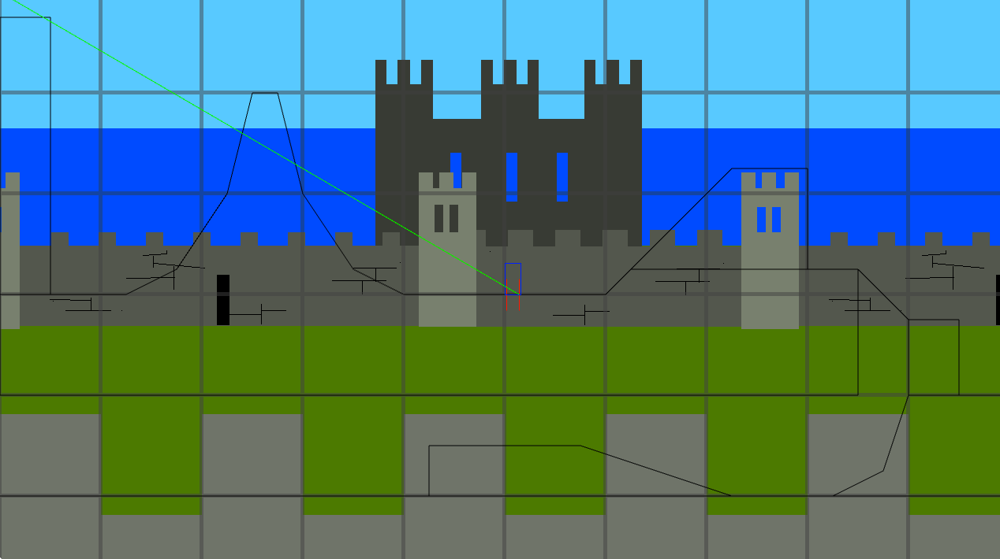

# Game and Graphics Programming in SDL and openGL
 Experimenting with game and graphics programming in C++ with SDL and openGL

- Custom OpenGL renderer in C++.
- Character movement, music, parallax scrolling,
- Collision detection supporting sloped surfaces, using sensors.
- Dynamic Music (different instrument tracks can come in and out by command or contextually)

https://github.com/KTRosenberg/Game-and-Graphics-SDL-openGL/assets/16908296/6873a6ab-4679-49c5-a59a-f68f504b5fe6

Here I hit different hotkeys to enable/disable different audio tracks. The audio is my original composition: (Unmute please.)

https://soundcloud.com/synchronizerman/time_rush_v_2_0_1

https://github.com/KTRosenberg/Game-and-Graphics-SDL-openGL/assets/16908296/d4d1a998-5071-42a4-b4b9-d0f6885c6205

